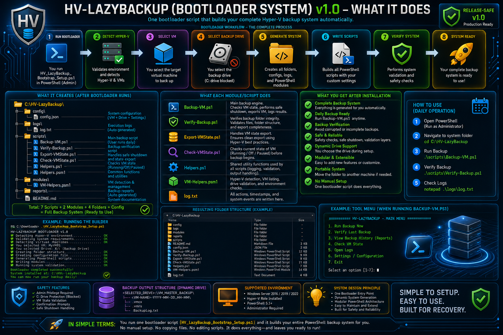
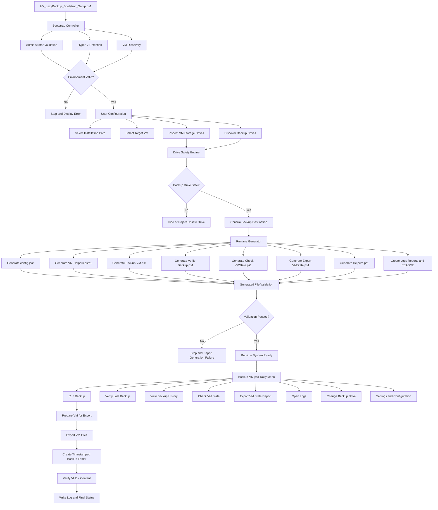

# 💾 HV-LazyBackup

<p align="center">
  
</p>

<p align="center">
  
  
  
  
  
  
</p>

<p align="center">
  <strong>One setup script. One generated runtime. Repeatable Hyper-V backups.</strong>
</p>

---

## 🚀 Overview

**HV-LazyBackup** is a PowerShell bootstrap system that generates a complete Hyper-V virtual-machine backup environment.

Instead of requiring users to manually create folders, configuration files, modules, scripts, logs, reports, and verification tools, HV-LazyBackup builds the complete runtime from one setup script.

The project is separated into two important layers:

| Layer | Purpose |
|---|---|
| **Bootstrap Layer** | Discovers Hyper-V, validates the selected VM and backup destination, and generates the complete runtime system. |
| **Runtime Layer** | Runs backups, verifies results, checks VM state, exports reports, updates configuration, and maintains logs. |

> **The bootstrap installs the system. The generated runtime operates the system.**

Developed by **TCDOVERLORD**.

---

## ⭐ Important Concept

HV-LazyBackup is a **bootstrap and unpacker engine**.

The repository contains the setup system. When the bootstrap is run, it generates the complete working backup application in a separate runtime folder.

```text
Repository Bootstrap
        |
        v
Environment Discovery
        |
        v
Safety Validation
        |
        v
Runtime Generation
        |
        v
Daily Backup System
```

You normally run the bootstrap during installation or regeneration.

You use the generated runtime scripts for normal daily backup operations.

---

## ▶️ Only Entry File

Run this file from the repository:

```powershell
.\HV_LazyBackup_Bootstrap_Setup.ps1
```

The bootstrap:

- Confirms that it is running in an appropriate PowerShell environment.
- Detects Hyper-V.
- Discovers available virtual machines.
- Lets the user select the target VM.
- Inspects the selected VM's virtual-disk locations.
- Discovers possible backup drives.
- Blocks `C:\` as a backup destination.
- Blocks drives that contain the selected VM's virtual disks.
- Lets the user choose a safe backup drive.
- Creates the complete runtime folder structure.
- Generates configuration files, modules, scripts, logs, reports, and documentation.
- Validates every generated PowerShell file before completing.
- Stops clearly and reports the problem when generation or validation fails.

---

# 🏗️ Architecture

HV-LazyBackup uses a staged architecture that keeps installation, safety validation, runtime generation, and daily backup operations separated.



## Architecture Layers

| Layer | Main Responsibility |
|---|---|
| **Bootstrap Controller** | Coordinates setup, discovery, validation, configuration, and generation. |
| **Environment Validation** | Confirms Hyper-V and VM availability before generation begins. |
| **Drive Safety Engine** | Prevents dangerous backup destinations from being selected. |
| **Runtime Generator** | Creates every file required by the installed backup system. |
| **Generated File Validation** | Parses generated PowerShell files before declaring setup successful. |
| **Runtime Menu** | Provides the daily user interface for backup and maintenance operations. |
| **Backup Engine** | Exports the selected VM into a timestamped backup folder. |
| **Verification Layer** | Confirms that expected virtual-disk content exists after backup. |
| **Logging and Reporting** | Records operations and produces VM state information. |

---

## 📦 Generated Runtime System

The default generated installation path is:

```text
C:\HV-LazyBackup\
|-- config.json
|-- README.md
|-- logs\
|   `-- log.txt
|-- reports\
|-- modules\
|   `-- VM-Helpers.psm1
`-- scripts\
    |-- Backup-VM.ps1
    |-- Verify-Backup.ps1
    |-- Check-VMState.ps1
    |-- Export-VMState.ps1
    `-- Helpers.ps1
```

## Generated Component Responsibilities

| Component | Responsibility |
|---|---|
| `config.json` | Stores the selected VM, backup drive, backup root, and runtime settings. |
| `Backup-VM.ps1` | Opens the daily operation menu and starts backup operations. |
| `Verify-Backup.ps1` | Verifies backup folders and checks for `.vhdx` content. |
| `Check-VMState.ps1` | Displays the current state of the configured VM. |
| `Export-VMState.ps1` | Writes a VM state report into the reports folder. |
| `Helpers.ps1` | Contains shared runtime helper functions. |
| `VM-Helpers.psm1` | Provides reusable Hyper-V management functions. |
| `logs\log.txt` | Records setup, backup, verification, and error activity. |
| `reports\` | Stores generated VM state and diagnostic reports. |
| Generated `README.md` | Documents how to operate the installed runtime. |

---

## ⚙️ Requirements

- Windows 10 or Windows 11
- PowerShell 5.1 or newer
- Hyper-V enabled
- Administrator access
- At least one local Hyper-V virtual machine
- A safe destination drive with sufficient free space

---

## 📥 Installation

Open **PowerShell as Administrator** on the Hyper-V host.

Move into the repository:

```powershell
cd <REPOSITORY_FOLDER>
```

Run the bootstrap:

```powershell
.\HV_LazyBackup_Bootstrap_Setup.ps1
```

Follow the prompts to select:

1. Runtime installation path
2. Target virtual machine
3. Safe backup destination drive

Unless another path is selected, the generated system is installed at:

```text
C:\HV-LazyBackup
```

---

## 🖥️ Daily Operation

Open **PowerShell as Administrator**:

```powershell
cd C:\HV-LazyBackup
.\scripts\Backup-VM.ps1
```

The generated daily menu contains:

```text
1. Run Backup Now
2. Verify Last Backup
3. View Backup History
4. Check VM State
5. Export VM State Report
6. Open Logs
7. Change Backup Drive
8. Settings / Configuration
9. Exit
```

---

## ⌨️ Direct Commands

### Run a Backup

```powershell
.\scripts\Backup-VM.ps1 -RunBackup
```

### Verify Existing Backups

```powershell
.\scripts\Verify-Backup.ps1
```

### Check the Configured VM State

```powershell
.\scripts\Check-VMState.ps1
```

### Export a VM State Report

```powershell
.\scripts\Export-VMState.ps1
```

---

## 💽 Backup Drive Safety

The selected backup root is stored in:

```text
config.json
```

HV-LazyBackup does not merely warn about unsafe backup drives. Unsafe drives are blocked or excluded from selection.

The following destinations are not allowed:

- `C:\`
- Any drive that stores the selected VM's virtual disks
- Any destination that fails runtime safety validation

This protects against placing the backup on the same drive as the source virtual disks.

### Change the Saved Backup Drive

Run:

```powershell
.\scripts\Backup-VM.ps1
```

Then select:

```text
7. Change Backup Drive
```

### Temporary Backup Drive Override

Use another safe drive for one operation:

```powershell
.\scripts\Backup-VM.ps1 -RunBackup -BackupDrive X
```

Verify backups on that drive:

```powershell
.\scripts\Verify-Backup.ps1 -BackupDrive X
```

The temporary override uses:

```text
X:\VM_MASTER_BACKUP
```

---

## 📁 Backup Output

Backups are stored using this pattern:

```text
<SELECTED_DRIVE>:\VM_MASTER_BACKUP\<VM-NAME>-MASTER-<TIMESTAMP>\
```

Example:

```text
X:\VM_MASTER_BACKUP\GrizTechW-MASTER-2026-06-16_12-03\
|-- VirtualDisk.vhdx
|-- VirtualMachine.vmcx
`-- RuntimeState.vmrs
```

The exact filenames can vary depending on the Hyper-V VM configuration and export output.

---

## 🛡️ Safety Features

- Administrator-level operation
- Hyper-V detection
- VM discovery and validation
- Selected VM storage-path inspection
- `C:\` backup destination blocking
- VM-storage-drive blocking
- Unsafe-drive filtering
- Safe VM state handling before export
- Generated script validation
- Timestamped backup folders
- Runtime logging
- `.vhdx` verification
- VM state reporting
- Clear setup and runtime failure messages

---

## 🔄 System Workflow

```text
Run Bootstrap
    |
    v
Validate Hyper-V Environment
    |
    v
Select Target VM
    |
    v
Inspect VM Storage Locations
    |
    v
Select Safe Backup Drive
    |
    v
Generate Runtime System
    |
    v
Validate Generated Scripts
    |
    v
Run Daily Backup Menu
    |
    v
Create Timestamped VM Backup
    |
    v
Verify Backup Content
    |
    v
Write Logs and Reports
```

---

## 📸 Repository Assets

The current README hero and architecture image uses:

```text
assets/hv-lazybackup-architecture-image.png
```

Recommended future asset structure:

```text
assets/
|-- hv-lazybackup-architecture-image.png
|-- HV-LazyBackup_Bootstrap.png
|-- HV-LazyBackup_Runtime_Menu.png
|-- HV-LazyBackup_Backup_Success.png
`-- HV-LazyBackup_Verification.png
```

---

## 🗺️ Roadmap

Potential future improvements include:

- Windows Scheduled Task integration
- Multiple VM backup profiles
- Configurable backup retention
- Free-space preflight validation
- Backup rotation
- Hash-based integrity checks
- Restore-assistance workflow
- Desktop notifications
- Email notifications
- HTML status reports
- Backup compression options
- GitHub release packaging

---

## ⚠️ Important Backup Notes

- Test the backup and restore process before depending on it.
- Keep more than one backup generation when storage permits.
- Confirm that the destination has enough available space.
- Do not interrupt an active Hyper-V export.
- Review logs after failed or interrupted operations.
- A backup should be considered dependable only after verification and periodic restore testing.

---

## 📊 Project Status

**Release-Safe Bootstrap System v1.3**

Current release priorities:

- Safe drive selection
- Hyper-V VM discovery
- Complete runtime generation
- Generated script validation
- Repeatable daily backup operation
- Backup verification
- Logging and reporting

---

## 🤝 Contributing

Contributions, testing feedback, documentation updates, and bug reports are welcome.

Changes should preserve the project's safety model. Any modification that removes or weakens destination validation, VM checks, generated-file validation, logging, or backup verification should include a clearly documented replacement safeguard.

---

## 📄 License

This project is licensed under the **TCDOVERLORD Personal Learning License (TPLL) v1.0**.

Permitted uses include:

- Personal learning
- Educational use
- Research and experimentation
- Private, non-commercial projects
- Personal source-code modification

Commercial use, resale, redistribution, business integration, consulting use, enterprise deployment, managed services, SaaS offerings, or inclusion in commercial products requires prior written permission from **TCDOVERLORD**.

See the [LICENSE](LICENSE) file for the complete license terms.

---

## 👨‍💻 Author

**TCDOVERLORD**

GitHub: [github.com/tcdoverlord](https://github.com/tcdoverlord)

Building practical Windows tools that automate repetitive work, protect important systems, and turn complicated technical workflows into repeatable processes.

---

<p align="center">
  <strong>If I have to do it twice... I build a system.</strong>
</p>

<p align="center">
  ⭐ Star the repository if HV-LazyBackup helps protect your virtual machines.
</p>
