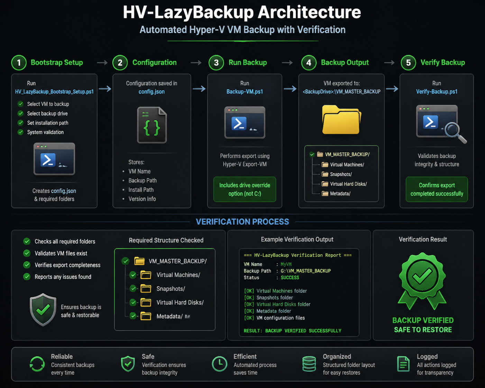

# 🔵 HV-LazyBackup (Bootloader System)

<p align="center">
  
</p>

<p align="center">
  
  
  
  
</p>

---

# 🟢 IMPORTANT CONCEPT

## ⚠️ THIS IS A BOOTLOADER SYSTEM (NOT A SCRIPT COLLECTION)

HV-LazyBackup is a **BOOTLOADER / UNPACKER ENGINE** that builds a full Hyper-V backup system dynamically.

---

# 🚀 ONLY ENTRY FILE

```powershell
.\HV_LazyBackup_Bootstrap_Setup.ps1
```

✔ This is the ONLY file the user runs manually  
✔ Everything else is generated automatically  

---

# 🧠 SYSTEM ARCHITECTURE

HV-LazyBackup works in 3 layers:

```
BOOTLOADER (Installer / Unpacker)
        ↓
GENERATED SYSTEM (Scripts + Config)
        ↓
OPERATION MODE (Backup + Verify execution)
```

---

# 🚀 FULL INSTALLATION FLOW

## 🟢 STEP 1 — DOWNLOAD REPOSITORY

```bash
git clone https://github.com/tcdoverlord/HV-LazyBackup.git
```

---

## 🟢 STEP 2 — OPEN POWERSHELL (ADMIN)

Run PowerShell as Administrator

---

## 🟢 STEP 3 — RUN BOOTLOADER (INSTALL PHASE)

```powershell
cd <REPO_FOLDER>
.\HV_LazyBackup_Bootstrap_Setup.ps1
```

---

## ⚙️ BOOTLOADER (WHAT HAPPENS)

During this phase:

### 🖥️ VM DISCOVERY
- Detects Hyper-V VMs
- User selects VM

### 💽 DRIVE SELECTION
- User selects backup drive
- System drive (C:) blocked

### 🧠 SYSTEM BUILD
Creates full environment:

```
C:\HV-LazyBackup\
├── config.json
├── logs\
└── scripts\
    ├── Backup-VM.ps1
    └── Verify-Backup.ps1
```

✔ RESULT: System is INSTALLED but NOT RUN YET

---

# 🚀 DAILY OPERATION MODE (POST INSTALL)

## 🟢 THIS IS HOW YOU USE THE SYSTEM

After installation is complete:

---

## 🟢 STEP 1 — OPEN POWERSHELL (ADMIN)

Always run as Administrator

---

## 🟢 STEP 2 — NAVIGATE TO SYSTEM FOLDER

If default install:

```powershell
cd C:\HV-LazyBackup
```

If custom install:

```powershell
cd <INSTALL_PATH>
```

---

## 🟢 STEP 3 — RUN BACKUP

```powershell
.\scripts\Backup-VM.ps1
```

What happens:
- VM state checked
- Safe shutdown if needed
- Hyper-V export executed
- Backup saved to selected drive

---

## 🟢 STEP 4 — VERIFY BACKUP

```powershell
.\scripts\Verify-Backup.ps1
```

Returns:
- ✅ BACKUP VALID (SAFE)
- ❌ BACKUP FAILED

---

# 📂 BACKUP OUTPUT STRUCTURE (DYNAMIC DRIVE)

The backup location is selected during bootloader setup.

```
<SELECTED_DRIVE>:\VM_MASTER_BACKUP\VM-NAME-TIMESTAMP\
```

### Example

If user selected `X:` drive:

```
X:\VM_MASTER_BACKUP\GrizTechW-2026-06-16_12-03\
    .vhdx
    .vmcx
    .vmrs
```

---

# 🛡️ SAFETY LAYER

✔ Admin required  
✔ Hyper-V validation  
✔ Disk selection protection  
✔ C: drive blocked  
✔ Confirmation prompts  
✔ Safe VM shutdown handling  

---

# 🧠 DESIGN PRINCIPLE

- One BOOTLOADER entry point
- Dynamic system generation
- No manual script creation required
- Fully portable backup framework

---

# ⚠️ STATUS

Release-Safe Bootloader System (v6 concept)

---

# 👨‍💻 AUTHOR

TCDOverLord
